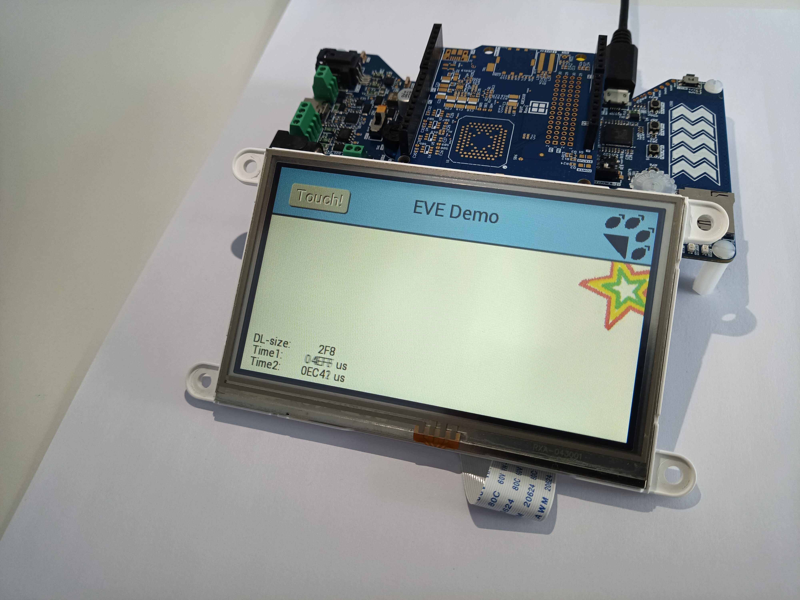
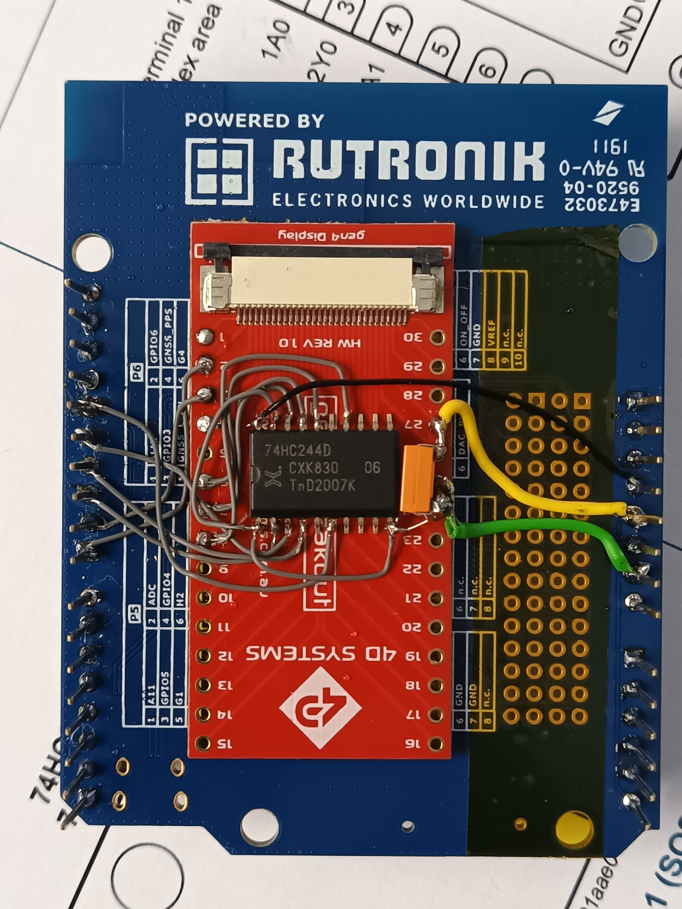
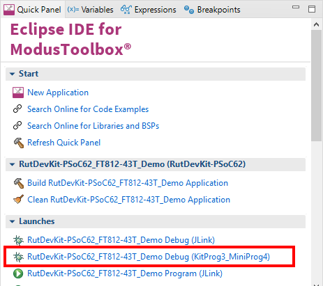

# RutDevKit-PSoC62 FT812-43T Demo

Rutronik Development Kit Programmable System-on-Chip CY8C6245AZI-S3D72 "RutDevKit-PSoC62_FT812-43T_Demo" Demo Application. 

This example demonstrates the usage of the 4D Systems FT812 based 4.3" display with integrated capacitive touch panel. The display is driven using SPI interface therefore the adapter for Arduino headers is needed. The adapter has IO buffer to decrease the interference in SPI wires. 

 

### Using the code example with a ModusToolbox IDE:

1. Import the project: **File** > **Import...** > **General** > **Existing Projects into Workspace** > **Next**.
2. Select the directory where **"RutDevKit-PSoC62_FT812-43T_Demo"** resides and click  **Finish**.
3. Select and build the project **Project ** > **Build Project**.

### Operation

The example was ported from the **"EVE2 / EVE3 / EVE4 code library"** provided by Rudolph Riedel on GitHub:

[`https://github.com/RudolphRiedel/FT800-FT813`](https://github.com/RudolphRiedel/FT800-FT813)

The demo application has static display features and  rotating  image introducing with EVE capabilities. The image rotation m;ay be started or stopped using a button on the screen. 

### Arduino SPI Adapter

No officially released adapter was used during the development of this application. The improvised hand made adapter was used instead. The 74HC244D octal buffer was used to improve the signal quality in long SPI lines driven at 20MHz.

 

### Debugging

If you successfully have imported the example, the debug configurations are already prepared to use with a the KitProg3, MiniProg4, or J-link. Open the ModusToolbox perspective and find the Quick Panel. Click on the desired debug launch configuration and wait for the programming to complete and debugging process to start.

## Legal Disclaimer

The evaluation board including the software is for testing purposes only and, because it has limited functions and limited resilience, is not suitable for permanent use under real conditions. If the evaluation board is nevertheless used under real conditions, this is done at one’s responsibility; any liability of Rutronik is insofar excluded. 

